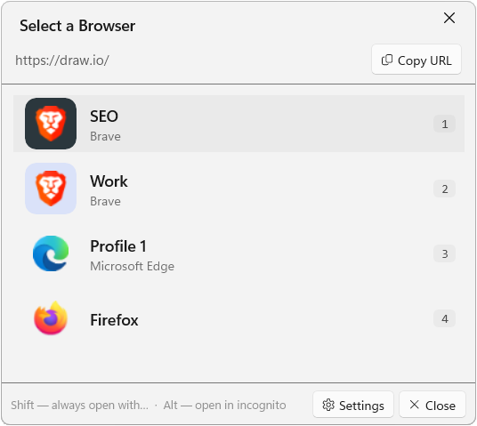

<div align="center">

# BrowserMux

**A modern browser selector for Windows 11.**
Choose which browser, or which profile, opens each link.

[](https://github.com/alxbd/browsermux/actions/workflows/ci.yml)
[](https://github.com/alxbd/browsermux/releases/latest)
[](LICENSE)
[](https://www.microsoft.com/windows)

[Website](https://browsermux.com) · [Download](https://github.com/alxbd/browsermux/releases/latest) · [Report a bug](https://github.com/alxbd/browsermux/issues)



</div>

---

## Why

Every link you click on Windows goes through a single "default browser". That's fine until you juggle a work profile, a personal profile, a dev Chromium, and the odd Firefox window. BrowserMux replaces the default with a tiny picker that pops up under your cursor, lets you choose, and gets out of the way.

Similar to [Hurl](https://github.com/U-C-S/Hurl) and [BrowserSelect](https://github.com/zumoshi/BrowserSelect), but with browser profile support. Built from scratch in 2026 with WinUI 3, Fluent Design, and Mica.

## Features

- **Pops up under the cursor**: DPI-aware, multi-monitor, disappears on lost focus.
- **Detects Chromium profiles** automatically (Chrome, Edge, Brave, Vivaldi, Opera): each profile is a separate card.
- **Routing rules**: send `github.com` to Firefox Work, `*.google.com` to Chrome Personal. Domain / glob / regex.
- **Routing rules Quick add** with `Shift+Click`.
- **Incognito / private mode** with `Alt+Click`.
- **Keyboard-first**: `1`-`9` to pick, `Tab` to navigate, `C` to copy URL, `Esc` to cancel.
- **Custom browsers**: add portable or unregistered executables.
- **Drag-and-drop reorder** in Settings.
- **System tray icon** with quick access to the launcher and settings.
- **Auto-update** from GitHub releases.
- **Fluent Design**: Mica backdrop, light/dark/system theme.

## Privacy

**Zero telemetry.** BrowserMux never phones home, never collects usage data, and never sends URLs anywhere. The only network call it ever makes is to `api.github.com` to check for a new release — and you can disable that in Settings → Updates.

All preferences and rules live in `%LOCALAPPDATA%\BrowserMux\` as plain JSON.

## Install

1. Download the latest `BrowserMux-Setup-x.y.z.exe` from the [Releases page](https://github.com/alxbd/browsermux/releases/latest).
2. Run the installer. By default it installs per-user (writes to `HKCU`). You can elevate to install machine-wide (`HKLM`).
3. Open **Settings → Apps → Default apps** and set BrowserMux as the default for `http` and `https`. BrowserMux can take you there directly from its About tab.

> A portable zip is also published if you'd rather not install. Note: the portable build can't be set as the system default browser without the registry entries the installer adds.

**Requirements**: Windows 11, .NET 9 Desktop Runtime (x64). The installer will prompt if missing.
**Footprint**: ~10 MB installer, ~ 50MB on RAM. The URL handler is a C# AOT native binary (<2 MB) with sub-50 ms cold start.

### Why does it need to be the default browser?

Windows only forwards `http`/`https` clicks to whichever app is registered as the default browser. For BrowserMux to intercept a link, Windows has to send it to BrowserMux first. The tiny `BrowserMux.Handler` exe receives the URL, forwards it over a named pipe to the main app (which shows the picker), and then the *real* browser you chose opens the link. BrowserMux itself never renders web content — it's a 2 MB router, not a browser.

### SmartScreen warning

Current releases are **not code-signed**, so Windows SmartScreen will show a "Windows protected your PC" dialog on first run. Click **More info → Run anyway**. An EV code-signing certificate is on the roadmap and will be applied to future releases — feedback welcome in the issues.

## Usage

### Picker

| Key | Action |
|---|---|
| `1` – `9` | Open the Nth browser |
| `Tab` / `Shift+Tab` | Navigate between cards |
| `Enter` | Open the selected card |
| `Alt`+click | Open in private/incognito mode |
| `Shift`+click | Create a routing rule for this domain |
| `C` | Copy URL to clipboard |
| `Esc` | Close without opening |

### Rules

Open **Settings → Rules** to configure automatic routing. Each rule matches a URL against a pattern and sends it to a specific browser (or forces the picker to show, useful for exceptions).

### Launcher

Bind a global hotkey in **Settings → General → Launcher hotkey** to open the picker without a URL. Useful as a quick launcher.

## Build from source

**Prerequisites**

- Windows 11
- Visual Studio 2026 with Windows App SDK workload
- .NET 9 SDK
- [Inno Setup 6](https://jrsoftware.org/isdl.php) (only to build the installer)

**Build & run**

```powershell
pwsh build.ps1 -Run
```

`build.ps1` goes through MSBuild (not `dotnet build`) so referenced projects rebuild correctly. Use `-Clean` for a full clean rebuild, `-Url "https://example.com"` to launch with a specific URL.

**Build the installer**

```powershell
pwsh build-installer.ps1
```

Outputs to `dist/`.

## Architecture

Three C# projects, .NET 9, WinUI 3 for UI and C# AOT for the URL handler (sub-50ms cold start).

```
BrowserMux.Handler/   AOT exe registered as default browser. Forwards URL via named pipe.
BrowserMux.App/       Main WinUI 3 app. Picker, Settings, tray icon, MVVM.
BrowserMux.Core/      Models + pure services (detection, rules, preferences).
Installer/setup.iss   Inno Setup 6 script (HKCU/HKLM registration).
```

See [CLAUDE.md](CLAUDE.md) for the full technical breakdown.

## Contributing

See [CONTRIBUTING.md](CONTRIBUTING.md) for dev setup, build tips, and PR guidelines.

## Built with Claude Code

I'll be upfront: most of BrowserMux was written with [Claude Code](https://claude.com/claude-code) driving the keyboard. I'm a solo dev who wanted a tool that didn't exist (maintained and supporting browser profiles), and it's thanks to AI-assisted coding that a project of this kind can come together in just a couple of hours of work.

That doesn't mean it's sloppy. The `CLAUDE.md`, `docs/`, and `.claude/skills/` files you'll see in the repo are the operating manual I've built up over the project — architecture rules, Win10 compatibility gotchas, build quirks, doc conventions. They're checked in on purpose, not leftovers. Every change goes through my review, the app runs on my own machine every day, and I own every bug.

If "vibe-coded" is a dealbreaker for you, fair enough — the source is right there, read it and judge. If you find something broken or ugly, open an issue.

## License

[MIT](LICENSE) © 2026 BrowserMux contributors.

## Credits

- Icon extraction via [Shell32](https://learn.microsoft.com/windows/win32/api/shellapi/nf-shellapi-shgetfileinfoa).
- Built with [WinUI 3](https://learn.microsoft.com/windows/apps/winui/winui3/) and [CommunityToolkit.Mvvm](https://learn.microsoft.com/dotnet/communitytoolkit/mvvm/).
